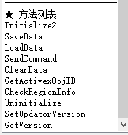

# 香港橘子API文档

## 前言

Hello，枫谷的程序员们，抱着学习，开源奉献的态度，下面将全面的讲解下关于香港橘子网页登录的整套实现流程，让枫谷的程序员们都可以自己实现自己的登录器。

> 感谢[pungin](https://github.com/pungin)为枫谷提供的缤放登录器，且开源提供学习。

文档使用简体中文进行输出，如需繁體自行轉換。

## 技术储备

首先，在读这个文档的时候，希望你具备

1. HTML基础知识
2. 正则表达式相关
3. HTTP协议，请求、响应等基础知识。
4. 熟悉一种开发语言
5. 知道什么是对称加密

以上，是您在阅读是必须要有的基础技术储备，不然你会比较难理解哦。


## 网页登录实现流程图

图画的不标准，能看懂就行哈。


前面的插件调用成功后，几乎已经成功一大半了，剩下的就是模拟用户访问网页，也就是发起`GET` 或者`POST`请求网页，然后用正则匹配到有用信息保存起来，进行下一次的请求。

## Beanfun登录

### 准备事宜


#### 请求相关

>  关于请求Header

请求时，header必须带上以下信息

|       key       |                             val                              |
| :-------------: | :----------------------------------------------------------: |
|   User-Agent    | Mozilla/5.0 (Windows NT 10.0; WOW64) AppleWebKit/537.36 (KHTML, like Gecko) Chrome/55.0.2883.87 Safari/537.36 |
| Accept-Encoding |                           identity                           |

如果是POST类请求，请带上`Content-Type` = `application/x-www-form-urlencoded`

**其余多余的`Header`请不要乱加哦。**

如图所示:


**注意：请务必把cookie保存起来，每次请求时都要带上**


#### BfService元件相关

在所有操作的前提是必须要调起`BfService`官方插件，否则会提示`OTP资料校验失败`哦，也就是需要安装官方提供的插件。

[安装包官方下载地址](http://hk.download.beanfun.com/beanfun20/beanfun_2_0_93_170_hk.exe)


### 过程

#### 1. 调起Beanfun插件

>  易语言创建COM注册DLL对象

```
.版本 2

.局部变量 对象, 对象

对象.创建 (“BFService.BFServiceX”, )
对象.查看 ()
```

其他语言大同小异，创建`BFService.BFServiceX`的对象，才可以调用插件方法。

其实就是这个`Interop.BFService.dll`。

[Interop.BFService.dll](./Interop.BFService.dll)

用DLL查看器，你可以看到这些方法。




我们关注的是他的方法

首先，第一次调用我们需要初始化`Initialize2(string,string,string,uint,string)`这个方法。

> 例如Java，至于前面怎么引用这个DLL，自己研究哈。

```java
//.....
BFService bf = new MyBFService();
bf.Initialize2("HK;Production", "", "", 0, "");
```

> 用易语言的话直接这样子。


调用成功后，右下角会弹出beanfun的插件弹窗初始化，初始化成功。

注意，该插件不能在线程中调用，只能够在主线程启用哦。


#### 2. 获取OTP

使用`GET`请求网页

```http
http://hk.beanfun.com/beanfun_block/login/index.aspx?service=999999_T0
```

将获取到的网页内容，使用正则将`OTP`截取下来。

> 正则表达式

```
var otp1 = "(.*?)";
```

#### 3. 登录方法

使用`GET`请求网页

```http
http://hk.beanfun.com/beanfun_block/login/id-pass_form.aspx?otp1={otp}&seed=0
```

上述`OTP`使用第二步的`OTP`拼接。

将获取到的网页内容，使用正则将三个参数截取下来。

分别是

```
id="__VIEWSTATE" value="(.*?)" />
```

```
id="__EVENTVALIDATION" value="(.*?)" />
```

```
id="__VIEWSTATEGENERATOR" value="(.*?)" />
```


使用`POST`方法，请求登录

```
http://hk.beanfun.com/beanfun_block/login/id-pass_form.aspx?otp1=” ＋ {otp} ＋ “&seed=0
```

请求参数列表


|          参数名          | 类型   |        值        |
| :----------------------: | ------ | :--------------: |
|      __EVENTTARGET       | String |     空字符串     |
|     __EVENTARGUMENT      | String |     空字符串     |
|       __VIEWSTATE        | String | 通过上述正则获取 |
|   __VIEWSTATEGENERATOR   | String | 通过上述正则获取 |
|    __EVENTVALIDATION     | String | 通过上述正则获取 |
|       t_AccountID        | String | 橘子账号（邮箱） |
|        t_Password        | String |  橘子账号的密码  |
|       btn_login.x        | String |        0         |
|       btn_login.y        | String |        0         |
| recaptcha_response_field | String | manual_challenge |

**注意：上述的字符串要使用URL编码方式转码，如果有中文则先UTF-8转换后再URL编码**

响应内容使用正则获取重要信息**账号Token**。

```
ProcessLoginV2\(\{token:\\"(.*?)\\",
```

获取后，全局保存这个`Token`

#### 4. 设置Token到插件，并封装获取方法

调用两次次插件的`SaveData`方法

```java
bf.SaveData("Seed", "0"); // 设置Beanfun插件为永不过期
```

```java
bf.SaveData("Token", {登录接口返回的token}); // 设置Beanfun插件为永不过期
```

> 封装成为获取Token的方法，每次获取Token的时候，都调用一次这两个方法，保证插件的有效性。

上述两个方法调用后，再调用`LoadData`方法，获取插件二次封装的`插件Token`。

```java
bf.LoadData("Token");
```


#### 5. 刷新登录状态

使用`GET`方法请求网页

```http
http://hk.beanfun.com/beanfun_block/auth.aspx?channel=game_zone&page_and_query=game_start.aspx%3Fservice_code_and_region%3D610074_T9&token={插件Token}
```

请留意一下上述参数

```
service_code_and_region // 游戏编号和地区编号
游戏编号：610074  // 新枫之谷
地区编号：T9  // 台湾
token：通过登录Token从插件中获取的插件Token。
```

使用正则匹配响应数据

```
document.location = “http://hk.beanfun.com/beanfun_block/game_zone/game_server_account_list.aspx
```

如果匹配成功，则说明登录成功了.


#### 6. 获取账号信息列表

使用`GET`请求这个地址
```http
https://hk.beanfun.com/beanfun_block/auth.aspx?channel=game_zone&page_and_query=game_start.aspx%3Fservice_code_and_region%3D610074_T9&token={插件Token}
```
上述使用插件获取的token补全

返回的数据不用处理，其实相当于一个授权操作。

然后再使用`GET`请求这个地址

```http
https://hk.beanfun.com/beanfun_block/game_zone/game_server_account_list.aspx?service_code=610074&service_region=T9
```

使用正则匹配出账号列表，这里把`html`放出来，正则自己写一下咯。

```HTML
<!DOCTYPE html>

<html xmlns="http://www.w3.org/1999/xhtml">
<head id="Head1"><title>
	Game Account Server List
</title><link type="text/css" rel="stylesheet" href="../styles/gamestart.css" />
    <link type="text/css" rel="stylesheet" href="../styles/jquery-ui-beanfun.custom.css?dt=20111109" />
    <script src="../scripts/jquery-1.6.4.min.js" type="text/javascript"></script>
    <script type="text/javascript" src="../scripts/jquery-ui-beanfun.custom.min.js?dt=20111109"></script>
    <script type="text/javascript" src="../scripts/common.js?dt=20111109"></script>
    <script type="text/javascript" src="../../locales/HK/scripts/ErrorHandler.js?dt=20111109"></script>
    <script type="text/javascript" src="../../locales/HK/scripts/msgbox_TW.js?dt=20111109"></script>
    <style type="text/css"> 
    body {
	    margin: 0;
	    padding: 0;
	    width: 100%;
	    height: 100%;
    }
    div#gif {
	    position: absolute;
	    top: 0;
	    left: 0;
	    min-height: 100%;
	    min-width: 100%;
	    height: 100%;
	    width: 100%;
	    background: transparent url(../../images/loading32x32.gif) no-repeat fixed center;
    }
    </style>     
	<script type="text/javascript">
		function StartGame(service_code, serivce_region, service_account_id, service_account_sn, service_account_display_name, service_account_auth_type, service_account_create_time) {
            window.location = "https://hk.beanfun.com/beanfun_block/game_zone/game_start_step2.aspx?service_code=" + service_code
                + "&service_region=" + serivce_region
                + "&service_account_id=" + service_account_id
                + "&service_account_sn=" + service_account_sn
                + "&service_account_display_name=" + service_account_display_name
                + "&service_account_auth_type=" + service_account_auth_type
                + "&service_account_create_time=" + service_account_create_time;
        }
    </script>
	<script type="text/javascript">
        var m_strServiceStage = "0";
        if (m_strServiceStage == 1) alert("目前本遊戲尚未正式開放，新開遊戲帳號必須輸入【遊戲啟動序號】，敬請留意官網公告最新消息！");
    </script>
</head>
<body>
    <div id="gif"></div>    
    <div id="divAppSettingXml" style="display:none;"><xml><app_settings></app_settings></xml></div>
    <div id="divServiceServerXml" style="display:none;"></div>
    <div id="divServiceSummaryXml" style="display:none;"></div>
    <div id="divMsgXml" style="display:none;"></div>     
    <div id="divMemberXml" style="display:none;"></div> 
    <div id="divLoadingMsgBox"></div>		        
    <div id="divGameAccountServerListAppWrapper" style="width:0px; height:0px">    
	    <div id="divGameAccountServerListApp"></div>	
    </div>  


    <div id="divMain" class="MainBox">
	    <div class="MainHeader">
		    <div class="GameThumbnail">
			    
		    </div>
            
            
		    <div id="divServiceInstruction">選擇遊戲帳戶:</div>
            
            
            
        </div>
	    <div id="divServiceAccountList" class="MainContent">
		    <ul id="ulServiceAccountList" class="ServiceAccountList">
		    <li class="" title="使用這個帳戶啟動遊戲" onclick="StartGame('610074', 'T9', 'T1383aabe42403912396', '1234567', '秋水小梦', 'N', '1/7/2011 3:46:00'); return false;"><div id="T1383aabe42403912396" sn="1234567" name="秋水小梦" inherited="false" visible="1" class="Account" title="編輯帳戶" onclick="GameAccount.ShowEditAcountDialog(event, 'T1383aabe42403912396'); return false;">秋水小梦</div><span class="StartButtonSmall" title="使用這個帳戶啟動遊戲"><input type="button" value="開始遊戲" /></span></li></ul>
	    </div>
	    <div class="MainFooter">
		    <div id="divServiceAccountAmountLimitNotice" class="InnerContent">此遊戲最多允許新增帳號數:1</div>
		    
	    </div>
    </div>
    <div id="divAddAcountDialog" class="PopDialog" title="新增遊戲帳號" style="display:none">
	    <ul class="MessageContentList">
		    <li>
			    <span id="spanNickname1">使用者名稱:</span>
			    <input id="txtServiceAccountDisplayName" type="text" maxlength="20" size="15" style="width: 210px" />
		    </li>
		    <li>
			    <span id="spanServiceAccountDisplayNameDesc" class="Annotation RightAlign"></span>
                <br />
		    </li>
		    
		    <li class="contract">
			    <input id="cbContract" name="" type="checkbox" value="" /><label id="lblContract" for="cbContract">我同意</label>
                <a href="#" id="aContract" onclick="GameAccount.ShowContractDialog(); return false;">服務條款</a>
		    </li>
	    </ul>
    </div>
    <div id="divAddAcountDialog2" class="PopDialog" title="新增遊戲帳號" style="display:none">
	    <ul class="MessageContentList">
		    <li>
			    <span>新增遊戲帳號，請稍等…</span>
		    </li>
	    </ul>
    </div>
    <div id="divContractDialog" class="PopDialog" title="服務條款" style="display:none">
        <div id="divContract" style="width: auto; min-height: 0px; height: 48px;"></div>
    </div>
    <div id="divEditAcountDialog" class="PopDialog" title="編輯遊戲帳號" style="display:none">
	    <ul class="MessageContentList">
		    <li>
			    <span id="spanNickname2">使用者名稱:</span>
			    <input id="txtNewServiceAccountDisplayName" type="text" maxlength="20" size="15" style="width: 210px" />
		    </li>
		    <li>
			    <span id="spanServiceAccountDisplayNameDesc2" class="Annotation RightAlign"></span>
		    </li>
	    </ul>
    </div>
    <div id="divAuthDialog" class="PopDialog" title="Generated by Server" style="display:none">
	    <ul class="MessageContentList">
		    <li>
			    <span>遊戲密碼:</span>
			    <input id="pwServiceAccountPW" type="password" maxlength="20" size="15" style="width: 210px" />
		    </li>
		    <li>
			    <a href="#" id="aForgotPassword" target="_blank">忘記密碼？</a>
		    </li>
	    </ul>
    </div>
    <div id="divAuthDialog2" class="PopDialog" title="Generated by Server" style="display:none">
	    <ul class="MessageContentList">
		    <li>
			    <span>這是受保護的帳號，無須授權即可升級。請點選"OK"開始進行升級</span>
		    </li>
	    </ul>
    </div>
	<script type="text/javascript">
        var m_strNaturalParentServiceCode = "";
        var m_strNaturalParentServiceRegion = "";
        var m_strServiceCode = "610074";
        var m_strServiceRegion = "T9";
        var m_strAccountServiceCode = "610074";
        var m_strAccountServiceRegion = "T9";
        var m_strServiceList = "610074_T9";
        var m_intServiceAccountAmountLimit = 1;
        var m_strServiceAccountID;
        var m_ServiceAccountAuthCallback;
        var m_strCANCEL = "取消";
        var m_strOK = "OK";
        var m_strAGREE = "同意";
        var m_strDISAGREE = "不同意";
        var m_strENTER_NAME = "請輸入使用者名稱！";
        var m_strSELECT_GENDER = "請選擇性別！";
        var m_strMUST_AGREE_TO_SERVICE_CONTRACT = "您必須先同意服務條款才可新增帳號！";
        var m_strCANNOT_USE_THIS_ACCOUNT_TO_START_GAME = "您的帳號無法啟動此遊戲，請與客服人員聯絡";
        var m_strENTER_GAME_PASSWORD = "請輸入您的遊戲密碼!";

        function AddServiceAccountToList(strServiceAccountSN, strServiceAccountID, strServiceAccountDisplayName, strServiceAccountCurtailName) { location.reload(); }
    </script>
    <script type="text/javascript" src="../scripts/game_server_account_list.js?dt=20111109"></script>
    <script type="text/javascript">
        
        
</script>
</body>
</html>

```


以上，提取有用信息，比如`StartGame`方法中的那堆，这是一个列表，新枫之谷默认只有一个账号哦。


## 获取游戏动态密码OTP

使用`POST`请求网页数据，这里我试过`GET`也是可以的。

```
http://hk.beanfun.com/beanfun_block/generic_handlers/get_otp.ashx?ppppp=&token={元件Token}&account_service_code=610074&account_service_region=T9&service_account_id={账号ID}&create_time={账号创建时间}&d={当前时间戳}
```

`URL参数解析`

```
token：通过官方插件获取的token
service_account_id：通过账号列表获取到的账号id
create_time: 通过账号列表获取到的账号创建时间
d: 当前时间戳(我传的是毫秒时间戳)
```

表单参数

|        参数名        |  类型  |               值               |
| :------------------: | :----: | :----------------------------: |
|     service_code     | String |             610074             |
|    service_region    | String |               T9               |
|  service_account_id  | String |    账号ID，通过账号列表获取    |
|     service_sotp     | String |     SN码，通过账号列表获取     |
| service_display_name | String |   账号名字，通过账号列表获取   |
| service_create_time  | String | 账号创建时间，通过账号列表获取 |


**返回OTP动态密码密文，这里划重点，如下所示**

```
1;27AC76235899FC1E333537CCEF54AB5C547D0390
```

首先，我们先把分号`;`前面包括分号去掉。

然后把去掉分号的内容，取前面8个字符，这个就是解密的**16进制Key**

```
27AC7623
```

后面的为密文

```
5899FC1E333537CCEF54AB5C547D0390
```

然后通过**DES ECB PKCS5 HEX**的方式进行解密！

注意，网上大部分你能抄到的都是通过`Base64`进行输出的。

可以自行在网上找一下这个加密方式的在线加解密的网站去测试一下，最终的解密结果就是动态密码哦

```
0269251887
```

自己对一下，如果解密的结果跟我贴出来的一致，证明你解密成功了。


## 其他接口

其他接口基本没什么难度，这里就不一一列举了，如果想要找接口，可以自行下载`QsBeanfunLogin-秋水Beanfun登录工具`。

并开启代理模式，使用`charles`代理工具进行抓包即可。

`QsBeanfunLogin`代理模式开启方式为，**右键点击Logo 15次**会弹出代理IP填写，不然你是抓不到包的哦。


**友情提示，官方提供了一个心跳方法，保持当前插件的有效性，建议定时请求**


## 繁体模拟区域元件

首先感谢[InWILL/Locale_Remulator](https://github.com/InWILL/Locale_Remulator)模拟区域元件的支持。

因为前LE作者已经宣布不会支持64位，所以LR就出现了，还是非常感谢作者的。

### 依赖

- `LRHookx64.dll` 64位软件支持
- `LRHookx32.dll` 34位软件支持
- `LRConfig.xml`  LR配置文件
- `LRProc.exe`   LR启动主程式
- `LRSubMenus.dll` LR菜单依赖

> 这里说明一下LRConfig.xml的配置
> 
```XML
<?xml version="1.0" encoding="utf-8"?>
<LRConfig>
  <Profiles>
    <Profile Name="TaiWan" Guid="tms"><!-- 这个Guid在启动的时候需要用到 -->
      <Location>zh-Hant-TW</Location><!-- LR台湾的编号 -->
      <CodePage>950</CodePage><!-- LR台湾的编号 -->
      <Font>None</Font><!-- 默认字体，不用设置 None -->
      <RunAsAdmin>true</RunAsAdmin>
      <HookIME>true</HookIME> <!-- 这是IME钩子是否开启设置（不开启游戏打字会乱码） -->
    </Profile>
  </Profiles>
</LRConfig>
```

### LR繁体模拟区域元件调起简单示例

把上述依赖文件全部复制到一个目录

使用管理员权限运行命令行，window常见是 `cmd` 或者 `powerShell` 都可以。

执行一下命令
```cmd
./LRProc.exe tms "C:/LR/LRHookx64.dll" "D:/MapleStory/MapleStory.exe"
```
```cmd
./LRProc.exe tms "[LRHookx64.dll路径]" "[游戏路径]"
```
注意加上双信号，不然路径有空格就会有问题，记得使用管理员模式运行，不然无效。

> 小提示

想免登录？ 那就像

## 我有话要说

吃水不忘挖井人，感谢[Beanfun（缤放登录器）的作者【卖力萌pungin】]([pungin/Beanfun: 繽放 - 樂豆第三方客戶端 (github.com)](https://github.com/pungin/Beanfun))提供的开源代码。

如果这个文档能够帮到正在写登录器的你，愿在你的软件上注明我的名字，感谢您的查阅，如有错漏欢迎[issues]([Issues · starmcc/QsBeanfunLogin (github.com)](https://github.com/starmcc/QsBeanfunLogin/issues))

By: [`starmcc [秋水小梦]`](https://github.com/starmcc/QsBeanfunLogin)


